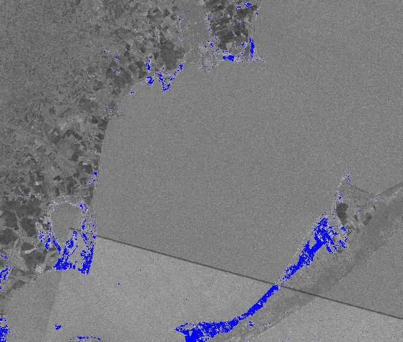

# Flooding in Rio Grande do Sul, Brazil: Analysis and Insights

## Introduction
The state of Rio Grande do Sul (Brazil) experienced heavy rainfall starting in late April 2024, persisting intensely for two weeks. These rains triggered widespread flooding, affecting entire cities, farmlands, and resulting in significant loss of life and property. In response to this disaster, we conducted an analysis utilizing the Google Earth Engine to visualize and understand the impact of the floods in the vicinity of São Lourenço do Sul (https://g1.globo.com/rs/rio-grande-do-sul/noticia/2024/05/29/um-mes-de-enchentes-no-rs-veja-cronologia-do-desastre.ghtml).

## Methodology
### Data Collection
- Utilized Sentinel-1 C-band SAR imagery from the Google Earth Engine.
- Filtered images by specific parameters including instrument mode (IW), polarization (VH), and orbit properties (descending).

### Image Processing
- Created composite images representing the before and after flood periods by mosaicing multiple images from each time period.
- Calculated the difference between the before and after flood composites to highlight areas with significant changes, potentially indicating flooded regions.

### Flood Detection
- Applied a threshold to the difference image to isolate pixels where the VH signal increased beyond a certain threshold.
- Identified potential flood areas by analyzing the pixels showing a significant increase in backscatter intensity, often represented as blue in the visualization.

## Results
- The analysis revealed numerous areas that experienced significant flooding, particularly along riverbanks and low-lying regions.

- The analysis revealed numerous areas that experienced significant flooding, particularly along riverbanks and low-lying regions.
- These flooded areas caused extensive damage to infrastructure, agriculture, and resulted in the displacement of thousands of people.

## Conclusion
The use of satellite imagery and remote sensing techniques, coupled with the power of the Google Earth Engine, provided valuable insights into the extent and impact of the floods in Rio Grande do Sul. By identifying and analyzing potential flood areas, we can better understand the scale of the disaster and aid in the development of effective disaster response and mitigation strategies.

## Running the project
Open this code in Google Colab, authenticate a project on GEE API, and run the interactive Map to check the flooded areas.
